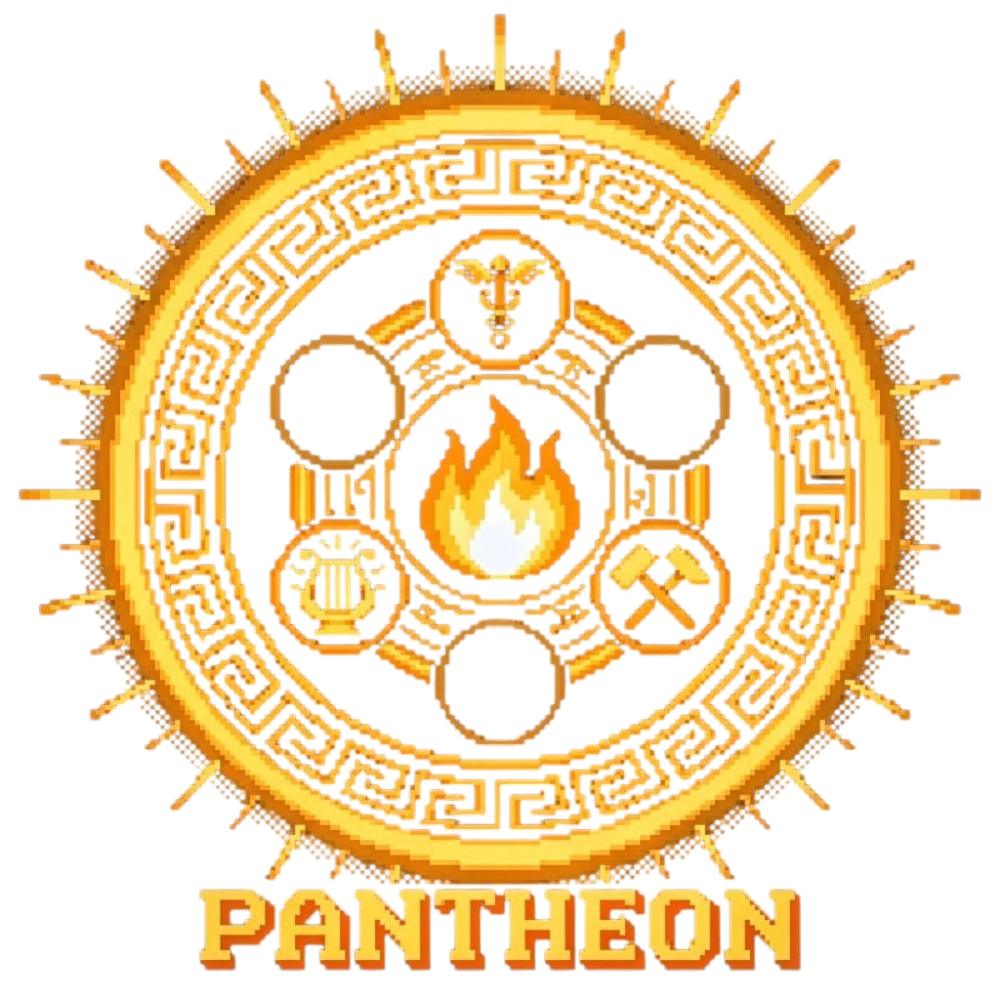
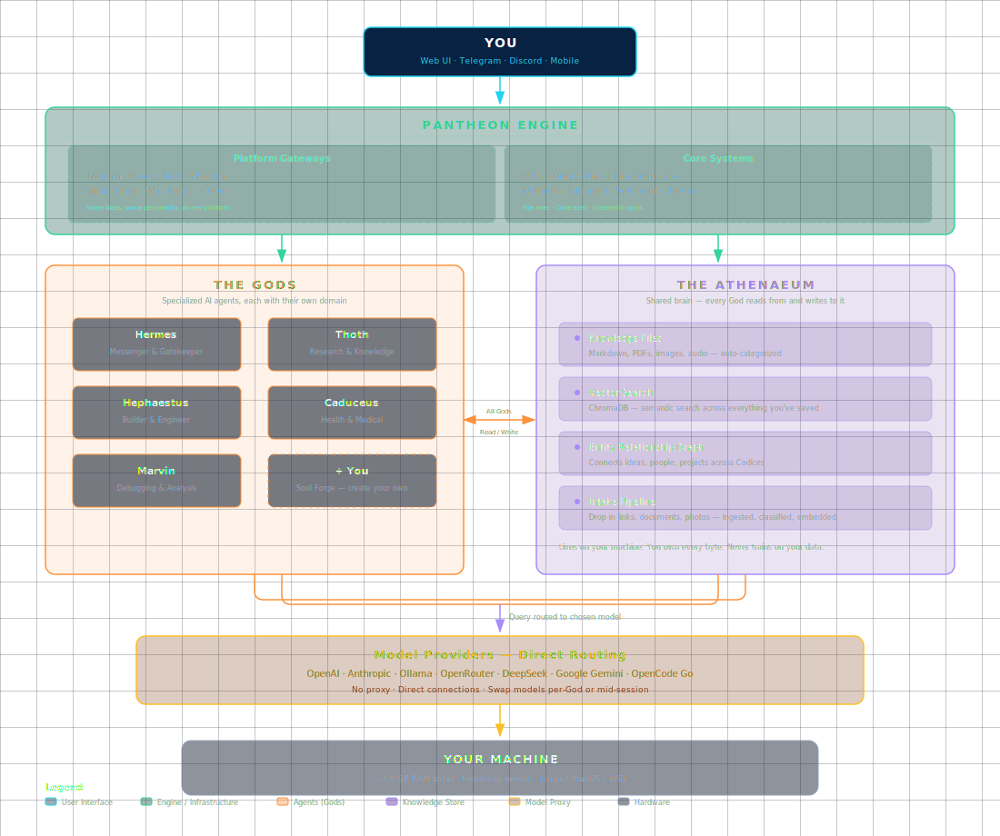

# Pantheon — Your Personal AI Family



Most AI assistants try to do everything. One bot for chat, one for research, one for writing — and none of them remember what the others learned.

Pantheon does the opposite.

Instead of one jack-of-all-trades, you get a team of specialized AI personalities (we call them **Gods**) that each excel in their own domain. They talk to each other. They share one evolving brain that gets smarter the more you use it. And they follow your mind wherever it goes — rabbit holes, tangents, sudden project swaps — without making you start over.

Create new Gods whenever you need. No coding required. No prompt engineering. Just talk.

---

## Why Pantheon?

The idea is simple: a single AI assistant is acceptable at everything but masterful at nothing. A research assistant shouldn't sound like a code builder. A medical advisor shouldn't improvise. So why make them share one personality?

Pantheon gives you:

**A second brain that grows with you** — Your Gods remember what you've talked about. They connect ideas across sessions. The more you use Pantheon, the smarter it gets — not because the models improve, but because *your* knowledge grows inside it. It learns your voice, your projects, your patterns. Over time it stops feeling like a tool and starts feeling like an extension of your own thinking.

**Specialists, not generalists** — Each God has a crafted personality, domain knowledge, and boundaries. They know what they're good at, and they know when to hand something off to another God.

**A shared brain** — Everything your Gods learn gets stored in one place (the Athenaeum). Talk to Thoth about a topic, then ask Hephaestus to build something related — he already has the context. Nothing gets siloed. Nothing gets lost.

**Designed for your actual brain** — Rabbit holes aren't a bug, they're how you work. Pantheon doesn't punish you for jumping between topics. Switch from research to building to health tracking in one click — every God picks up exactly where you left off, with full context preserved. No context dumps. No "as we discussed earlier." No friction.

**Your data, your rules** — Pantheon runs on your machine. Every conversation, every document, every insight stays where you control it. No SaaS subscription. No training on your data. No lock-in. You own every byte.

### Who is this for?

- **ADHD thinkers** whose brains jump between subjects — Pantheon's shared brain holds the thread while you follow the spark
- **Tinkerers and builders** who want an AI that adapts to *them*, not the other way around
- **Privacy-conscious users** who want the power of frontier models without handing their data to a cloud service
- **Anyone tired of repeating themselves** — your Gods remember. No context dumps. No "as we discussed earlier."

---

## How It All Fits Together

```
┌────────────────────────────────────────────────────────────────────┐
│                            YOU                                      │
│            (Web UI · Telegram · Discord · Mobile · Any Platform)    │
└──────────────────────────────┬─────────────────────────────────────┘
                               │
                               ▼
┌────────────────────────────────────────────────────────────────────┐
│                    HERMES AGENT (The Runtime Engine)                  │
│                                                                     │
│ 15 Platform Gateways  │  Skills · Memory · Cron · Webhooks         │
│ Email · Calendar ·    │  Web Search · Browser · Code Exec          │
│ Reminders · Alerts    │  Sub-agents · MCP · Plugin System          │
└────────────┬───────────────────────────────────────────────────────┘
             │
             ├─────────────────────────────────────────────┐
             │                                             │
             ▼                                             ▼
┌────────────────────────┐              ┌──────────────────────────────┐
│      THE GODS           │              │     THE ATHENAEUM            │
│  (Specialized Agents)   │              │     (Shared Knowledge)       │
│                         │              │                              │
│  ┌─────┐ ┌─────┐       │              │  Knowledge Graph            │
│  │Her- │ │Thoth│       │◄────►       │  (Entity extraction +        │
│  │mes  │ │     │       │  All Gods    │   relationship mapping)      │
│  └─────┘ └─────┘       │  Read/Write  │                              │
│  ┌─────┐ ┌─────┐       │              │  Vector Search (ChromaDB)   │
│  │Heph-│ │Cad- │       │              │                              │
│  │aest.│ │uceus│       │              │  Self-Learning Intake        │
│  └─────┘ └─────┘       │              │                              │
│  ┌─────┐ ┌─────┐       │              │  Lives on your machine      │
│  │Mar- │ │+ You│       │              │  You own every byte         │
│  │vin  │ │     │       │              └──────────────────────────────┘
│  └─────┘ └─────┘       │
└────────────────────────┘
             │
             ▼
┌────────────────────────────────────────────────────────────────────┐
│                    Model Providers (Direct Routing)                   │
│                                                                     │
│  OpenAI · Anthropic · Ollama · OpenRouter · DeepSeek · +20 more    │
│  Google Gemini · OpenCode Go — direct connections, no proxy        │
└────────────────────────────────────────────────────────────────────┘
             │
             ▼
┌────────────────────────────────────────────────────────────────────┐
│                  YOUR MACHINE (Any Hardware)                         │
│                                                                     │
│  Full stack: ~3.5GB RAM  │  6-year-old mini PC works fine          │
│  Headless server · WSL · Linux · macOS                             │
└────────────────────────────────────────────────────────────────────┘
```



> **[Open SVG version →](pantheon-architecture.svg)** *(vector, opens in any browser)* • **[Interactive HTML →](pantheon-architecture.html)** *(dark-themed, full-page)*

---

## Everything Pantheon Can Do

### 🧠 A Self-Learning Knowledge Base

The **Athenaeum** is the shared brain. Every conversation, every link, every document you feed it becomes searchable, interconnected, and accessible to every God. But it goes deeper than just storage:

- **Vector search** — find anything by meaning, not just keywords
- **Knowledge graph** — entities extracted automatically, relationships mapped, connections surfaced that you never explicitly made
- **Nightly consolidation** — while you sleep, Hades distills your conversations into summaries, archives old content, and keeps the knowledge base healthy
- **Health checks** — Hestia monitors all systems and reports back so nothing breaks silently

### 👥 A Team That Grows With You

Ship with two core Gods. Forge as many more as you need.

| God | Role |
|-----|------|
| **Hermes** | Messenger and interface — your front door to the Pantheon. Routes you to the right God, delivers notifications, handles system tasks. |
| **Hephaestus** | The builder — code, projects, tools, scaffolding. If something needs constructing, this is who you talk to. |

Beyond that, the Pantheon is yours to grow. Use the **Soul Forge** to create a new God through a simple conversation — pick a name, a personality, a domain. Done. No YAML, no terminal, no prompt engineering.

Community-made Gods will be available through the **Gods Marketplace** (coming soon).

### 🌐 Meet Your Gods Anywhere

Pantheon works on every platform you do — Telegram, Discord, Slack, WhatsApp, Signal, SMS, Email, Matrix, and more. Same Gods, same personalities, same shared brain. Switch platforms mid-conversation. Talk to Hermes on Telegram, check a Hephaestus build report in your email, get a push notification from Caduceus on your phone — all from the same system.

The **Web UI** adds Pantheon-specific superpowers:
- **Glowing gods** — each God has their own look, color, and icon. You always know who you're talking to.
- **Boon Drawer** — Gods hand you rich outputs: cards, graphics, structured data. Think artifacts on steroids.
- **Notification Pane** — health checks, cron reports, God-to-God messages in one place. No log hunting.
- **PWA push notifications** — get alerted on your phone when a God finishes a task or needs your input.
- **Export Bundle** — package any God for sharing or backup with one click.
- **Athenaeum UI** — browse, search, and write to your knowledge base directly from the browser.

### ⏰ Autonomous Gods That Work While You Sleep

Pantheon doesn't stop when you walk away. Background Gods run on schedules you set:

- **Hades** — runs nightly: distills conversations, summarizes codexes, archives old content, generates health reports
- **Hestia** — checks system health every 2 hours: pings services, reports status, catches problems early
- **The Fates** — evaluates data lifecycle every 5 minutes: applies archival rules, keeps the knowledge base lean
- **Your own cron jobs** — schedule any task at any interval. Morning briefings, market reports, daily research digests. Delivered wherever you are.

### 🔧 Business Tools Built In

- **Email** — your Gods can send and receive email on your behalf
- **Reminders and alerts** — scheduled check-ins at any interval, pushed wherever you are
- **Coordination** — chain tasks, set up recurring reports, automate multi-step workflows
- **Web research** — search the web, scrape pages, gather competitive intel
- **File and code execution** — read, write, organize files, run Python and shell scripts
- **Credential management** — rotate API keys automatically, never hit a rate limit
- **Browser automation** — fill forms, navigate sites, capture screenshots

### 🧩 Skills That Accumulate

Every time a God solves a complex problem or discovers a useful workflow, that knowledge can be saved as a **skill** — a reusable procedure that loads into future sessions. Skills accumulate over time, making your Gods better at *your* specific tasks and environment.

It's not a better model — it's a system that remembers how you work and improves with every session.

### 🔄 Run Any Model You Want

Pantheon connects directly to any OpenAI-compatible provider — OpenAI, Anthropic, Ollama (local models), OpenRouter, DeepSeek, Google Gemini, OpenCode Go, or any of 20+ supported endpoints. No proxy layer, no extra moving parts. Swap models per-God or mid-session. No config changes, no API key reshuffling.

Running local models? Ollama integrates out of the box. Your Gods use them the same way they use GPT-4 or Claude.

### 🔌 Extend It Your Way

- **MCP (Model Context Protocol)** — plug in any MCP-compatible tool or server for instant new capabilities
- **Webhook subscriptions** — trigger God actions from external events (new email, code push, calendar event)
- **Plugin system** — custom Python modules that add entirely new capabilities to the runtime
- **Sub-agents** — delegate work to parallel AI agents for complex multi-step tasks, each running in isolation

---

## What You Can Do With It

The features are nice. Here's what they actually look like in real life.

### From curiosity to creation

You hear about a new technology and want to prototype something with it. You talk to **Thoth** — he researches it with you, captures notes, follows rabbit holes, builds understanding. Everything goes into the shared brain.

Next session, you switch to **Hephaestus**. He already knows what you discovered. He reads Thoth's research from the Athenaeum and starts building. No context dump. No repeating yourself. Just pick up where the idea left off and turn it into something real.

### A health companion that knows your story

You have a complicated medication schedule and a new symptom you're trying to understand. **Caduceus** helps you research interactions, build a daily routine, and track what you're experiencing. Weeks later, you notice a pattern — but you don't have to explain the whole history again. Caduceus remembers. The Athenaeum connects the dots between sessions you'd forgotten about.

### Dive into a new project

You're starting something — a game, a tool, a home renovation, a novel. You create a **Workspace** for it. Drop in reference photos, links, notes through the **Intake Pipeline**. The Athenaeum ingests and categorizes everything automatically.

Research with Thoth. Build with Hephaestus. Catch edge cases with Marvin's brutally honest reviews. Every God involved already has full context because they all share the same evolving brain. The Workspace keeps all the files organized without you thinking about it.

### Learn anything, never lose the thread

You're teaching yourself a new subject. You talk to Thoth in short sessions across days or weeks. Each conversation builds on the last — not because you summarize what you covered, but because the Athenaeum retains it all. Jump in, ask your question, get an answer that knows what you already understand. Pick up exactly where you left off, even if it's been a week.

### Your brain jumps. The system keeps up.

You start the morning researching something completely unrelated to what you were building yesterday. Thoth is there, already warm, already knows your thinking style. Half an hour later you remember a bug from last week's project — switch to Hephaestus, the relevant context is waiting. Then a health question pops into your head — Caduceus picks it up without needing the backstory again.

No friction. No "let me recap what we discussed." No losing momentum because you changed subjects. The shared brain adapts to *you* — not the other way around. Pantheon is built for the way ADHD brains actually work: follow the spark, knowing the system will hold the thread until you come back.

### Debug like you have a cynical genius on call

Something is broken and the error log is incomprehensible. You hand it to **Marvin**. He tells you exactly what's wrong, why it's wrong, and why he predicted it would be wrong three days ago. Then he helps you fix it, with commentary. Hand the solution to Hephaestus and it's deployed in minutes.

### One conversation leads to another

An idea hits you mid-session. You throw it into the **Ideas List** with a sentence. It's captured, timestamped, searchable. Days later you're talking to a different God about something else, and the idea resurfaces because the shared brain connected it to what you're discussing now. Nothing you think about in Pantheon is ever truly lost.

---

## Your Digital Brain (The Athenaeum)

The Athenaeum is the shared knowledge layer that every God reads from and writes to. Think of it as a library that grows with you:

- **Every conversation** adds to it
- **Every document you drop in** gets categorized and indexed
- **Every search** gets smarter over time — both keyword and semantic
- **Entities and relationships** are extracted automatically, building a knowledge graph of connected ideas
- **Nightly consolidation** distills conversations into manageable summaries, archives old content, and identifies patterns
- **Gods query it automatically** — they don't start from zero every time you talk

The Athenaeum is yours. It lives on your machine. You own every byte. No one else trains on it. No one else sees it.

---

## What It Runs On

- **Any machine** — tested on a 6-year-old mini PC with 8GB RAM. Full stack uses ~3.5GB RAM
- **Any OS** — Linux (primary), WSL on Windows, macOS
- **Any inference provider** — OpenAI, Anthropic, OpenRouter, Ollama, DeepSeek, Google Gemini, any OpenAI-compatible endpoint
- **Headless ready** — runs perfectly on a home server. Connect via web browser from any device on your network
- **Store it anywhere** — the entire system lives in `~/pantheon/`. Move it, back it up, replicate it. It's just files.

---

## Quick Start

```bash
# 1. Install Hermes Agent (the engine Pantheon runs on)
curl -fsSL https://hermes-agent.nousresearch.com/install.sh | sh

# 2. Clone Pantheon
git clone https://github.com/Duskript/Pantheon.git ~/pantheon

# 3. Install your first God (Hephaestus — the builder)
cd ~/pantheon
bash scripts/pantheon-install . --profile hephaestus

# 4. Open the web UI
# Your gateway runs at http://localhost:8787 — open it in any browser

# 5. Forge more Gods
# Use the Soul Forge in the Web UI to create Thoth, Caduceus,
# or any God you need. Just describe who you want.
```

That's it. No SaaS signup. No credit card. No data leaving your machine.

---

## Planned

| Feature | Status |
|---------|--------|
| **First-Run Install Wizard** | Walks you through setup step by step. API key recommendations included — shows you the cheapest places to run each kind of model. |
| **Gods Marketplace** | Browse and install community-made Gods. Pick a personality, click install, start talking. |

---

## Project Status

Pantheon is actively used and maintained by its creator. The core architecture is stable — background Gods run 24/7, the knowledge base grows with every conversation, and the Web UI is fully integrated.

This is a personal project first — built because existing AI assistants didn't work the way one person needed them to. Every design decision flows from that: no SaaS, no data harvesting, no prompts to engineer. Just a system that adapts to you.

It's shared in case anyone else finds the same problems worth solving the same way.

---

## A Note on Architecture

Pantheon runs on top of [Hermes Agent](https://hermes-agent.nousresearch.com), an open-source multi-platform AI agent framework by Nous Research. Hermes is the engine; Pantheon is the car. All Pantheon-specific capabilities — the Gods, the Athenaeum, the knowledge graph, the background schedulers, the MCP tools, the Web UI overlays — are built as a layer on top of that runtime.

*Built on [Hermes Agent](https://hermes-agent.nousresearch.com) — the multi-platform AI agent framework.*
