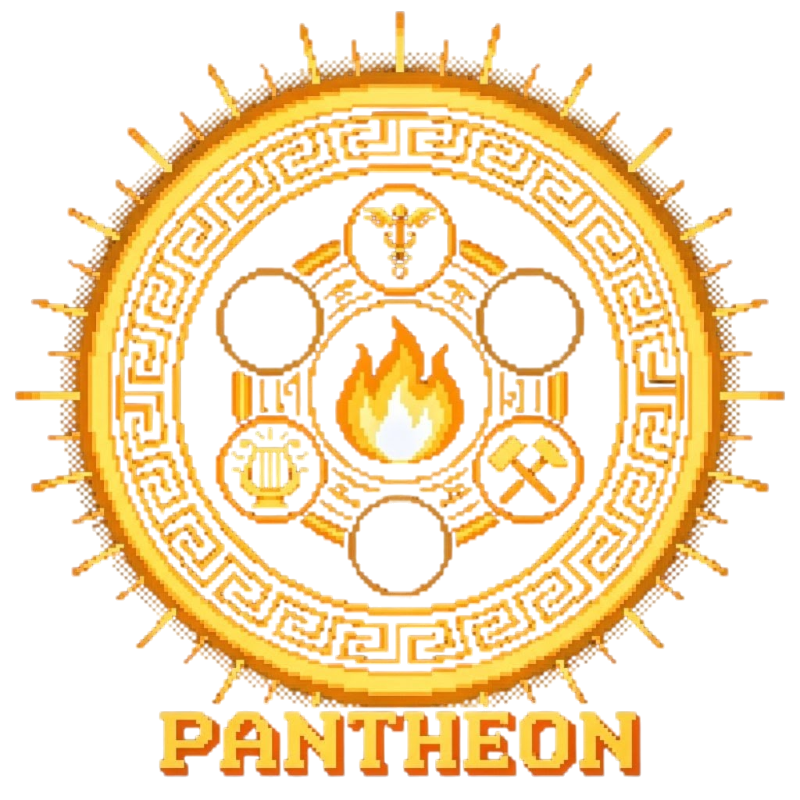
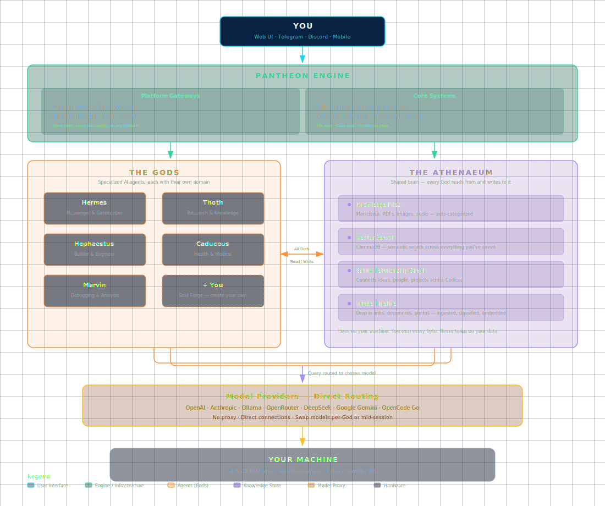

# Pantheon: Your Personal AI Family



Pantheon is a private, local-first AI operating system built around a simple idea: one assistant should not have to be everything.

Instead of one general-purpose bot, Pantheon gives you a family of specialized AI personalities, called **Gods**, that each know their role. They share context, hand work to each other, build durable knowledge, and keep working even when you walk away.

It is not just chat. It is memory, tools, background work, routing, dashboards, workflows, plugins, skills, and a knowledge base that grows with you.

---

## What Makes Pantheon Different

### A family of specialists, not one generic assistant

Each God has a name, personality, domain, tools, boundaries, and memory. A builder should not sound like a medical companion. A researcher should not improvise infrastructure. A writer should not pretend to be a code reviewer.

Pantheon keeps those roles separate while giving them one shared foundation.

### A one-of-a-kind memory system

Pantheon combines several layers of memory instead of relying on a single chat transcript:

- **Rolling working memory** through the `last30days` skill, giving Gods a durable view of recent work without stuffing every conversation into the prompt.
- **Profile memory** for compact, stable preferences and environment facts.
- **Session recall** for searching past conversations when a God needs history.
- **Athenaeum knowledge storage** for durable notes, decisions, plans, references, and codices.
- **Vector retrieval** for semantic search over knowledge.
- **Knowledge graph extraction** for entities, relationships, and cross-topic connections.
- **Skill memory** for reusable procedures that improve the system over time.
- **Pluggable Hermes memory providers** including Byterover, Hindsight, Holographic, Honcho, Mem0, OpenViking, RetainDB, and Supermemory.

The result is not “the model remembers.” The system remembers. Models can change, providers can change, contexts can compact, and the memory layer remains yours.

### Local-first and user-owned

Pantheon is designed to run on your machine. Your prompts, files, notes, Codices, plugin state, cron outputs, and long-term knowledge remain under your control. Use cloud models if you want their power; keep the operating system and memory on hardware you own.

### Built for nonlinear minds

Pantheon assumes you will jump topics. Research in the morning, build in the afternoon, health question at night, random product idea three days later. The system is designed to hold the threads so you do not have to keep re-explaining yourself.

---

## High-Level Architecture

```text
┌────────────────────────────────────────────────────────────────────┐
│                                YOU                                 │
│        Web UI · Discord · Telegram · Slack · Email · Mobile         │
└──────────────────────────────┬─────────────────────────────────────┘
                               │
                               ▼
┌────────────────────────────────────────────────────────────────────┐
│                        HERMES AGENT RUNTIME                         │
│                                                                    │
│  Providers · Tools · Skills · Memory · Cron · Webhooks · MCP        │
│  Sub-agents · Browser · Search · Files · Code Exec · TTS · Media    │
└──────────────┬───────────────────────────────┬─────────────────────┘
               │                               │
               ▼                               ▼
┌──────────────────────────────┐   ┌─────────────────────────────────┐
│             GODS              │   │            ATHENAEUM             │
│  Specialized AI personalities │   │       Shared knowledge layer     │
│                              │   │                                 │
│  Hermes      Operations       │   │  Codices                         │
│  Hephaestus  Building/PM      │◄─►│  Session summaries               │
│  Thoth       Research/review  │   │  Knowledge graph                 │
│  Marvin      Engineering      │   │  Vector retrieval                │
│  Iris        Design           │   │  Decisions and plans             │
│  Caduceus    Health           │   │  Rolling memory                  │
│  + custom Gods                │   │                                 │
└──────────────┬───────────────┘   └─────────────────────────────────┘
               │
               ▼
┌────────────────────────────────────────────────────────────────────┐
│                         EXTENSION LAYER                             │
│                                                                    │
│  Hermes plugins · memory providers · MCP servers · shared skills    │
│  phone gateway · n8n bridge · Olympus BTST MCP · Ichor gates        │
└────────────────────────────────────────────────────────────────────┘
               │
               ▼
┌────────────────────────────────────────────────────────────────────┐
│                         MODEL PROVIDERS                             │
│                                                                    │
│  OpenAI · Anthropic · OpenRouter · Ollama · DeepSeek · Gemini       │
│  OpenCode Go · Groq · local models · OpenAI-compatible endpoints    │
└────────────────────────────────────────────────────────────────────┘
```



> [Open SVG version →](pantheon-architecture.svg) · [Interactive HTML →](pantheon-architecture.html)

---

## Feature Catalog

### Gods and orchestration

- **God profiles** with SOUL/persona files, boundaries, tools, and domain ownership.
- **Multi-god routing** so work goes to the right specialist instead of the loudest assistant.
- **God-to-god handoffs** with structured contracts.
- **Conductor workflow patterns** for larger chains of work.
- **Sub-agent delegation** for parallel investigation and verification.
- **God packaging** for exporting and sharing reusable God profiles.
- **Soul Forge direction** for creating new Gods through conversation rather than hand-editing prompts.

### Memory and knowledge

- **Athenaeum Codices**: durable, file-backed knowledge stores.
- **`last30days` rolling memory skill**: a living context layer for recent work, decisions, corrections, and unresolved threads.
- **Hermes profile memory**: compact durable facts about the user and environment.
- **Session search**: full-text recall over past conversations.
- **Vector search**: meaning-based retrieval over stored knowledge.
- **Knowledge graph**: entity and relationship extraction for connected understanding.
- **Nightly/daily consolidation patterns**: summaries, health checks, stale-context reduction, and digest generation.
- **Decision logs**: append-only records for operator-locked decisions.
- **Skill crystallization**: recurring procedures become reusable skills instead of being rediscovered.

### Skills

Pantheon ships and uses a large skill ecosystem:

- **Shared Pantheon skills** for packaging, release prep, notifications, project ideas, migrations, UI work, n8n, Conductor, Olympus, Athenaeum maintenance, and more.
- **PM skills** for product strategy, discovery, PRDs, roadmaps, market research, GTM, metrics, personas, pricing, Lean Canvas, SWOT, Porter, PESTLE, and product naming.
- **Development skills** for debugging, TDD, React, code review, deployment, MCP, GitHub, databases, and release workflows.
- **Creative skills** for diagrams, PDFs, infographics, comics, mockups, pixel art, music, and visual artifacts.
- **Dojo / self-improvement skills** that mine failed trajectories and convert hard-won lessons into reusable procedures.

Skills are procedural memory. When a God learns how to solve a class of problem, Pantheon can preserve that know-how.

### Plugins and extension systems

Pantheon includes the Hermes Agent plugin architecture and Pantheon-owned plugins:

- **Model provider plugins** for direct provider routing.
- **Web search and browser provider plugins**.
- **Image, video, media, and TTS integrations**.
- **Dashboard auth and platform adapters**.
- **Cron, observability, and context-engine plugins**.
- **Memory provider plugins**: Byterover, Hindsight, Holographic, Honcho, Mem0, OpenViking, RetainDB, Supermemory.
- **Pantheon plugins** for Demeter intake, Athenaeum graph access, notifications, and profile-aware operations.
- **Ichor gates** for guardrails, filters, quality checks, and workflow harnessing.
- **Tokenjuice and stream-retrieval** for token/context management and retrieval support.

Credentials, provider-local databases, runtime state, and user-specific plugin data are intentionally excluded from the public repository.

### MCP servers

Pantheon can expose and consume tools through Model Context Protocol:

- **Pantheon MCP server** for Athenaeum, messaging, and God-system operations.
- **Olympus BTST MCP** for browser/task-state tooling.
- **Hermes n8n MCP integration** for workflow automation.
- **External MCP compatibility** so new tool servers can be wired in without redesigning the agent runtime.

### Interfaces

- **Pantheon Web UI** with god-themed identity, conversations, artifacts, and system views.
- **PWA support** for installable mobile/desktop use.
- **Discord and Telegram gateways** for chatting with Gods from normal messaging apps.
- **Slack, email, SMS, Signal, Matrix, and other Hermes-supported platforms** depending on configured gateways.
- **Phone gateway skill and daemon** for mobile/device integration experiments.
- **Notifications** for task completion, errors, review requests, and chain stalls.

### Automation and background work

- **Cron jobs** that run prompts, skills, or scripts on a schedule.
- **Watchdog patterns** for disk, memory, service, and API health checks.
- **Morning/daily briefing patterns**.
- **Digest generation** and incremental knowledge maintenance.
- **Webhook subscriptions** so external events can trigger agent work after operator approval.
- **n8n integration** as the scheduled/triggered workflow layer where appropriate.

### Building and product work

Pantheon is not only a chat layer. It is used to plan, build, review, and ship:

- Product strategy artifacts: Lean Canvas, SWOT, PESTLE, Porter, Ansoff, positioning, pricing, GTM, ICPs, personas, OKRs, and PRDs.
- Build plans and architecture docs.
- Kanban/card decomposition for multi-agent work.
- Tiered QA gates and spec-conformance review.
- Browser verification for real UI behavior.
- GitHub cleanup, release prep, README/doc discipline, and secret-scan workflows.

### Tools available to Gods

Depending on profile and permissions, Gods can use:

- File read/write/search.
- Shell commands and long-running processes.
- Web search and page extraction.
- Browser automation and screenshots.
- Image analysis and generation.
- Text-to-speech.
- Cron scheduling.
- Git/GitHub workflows.
- Databases, APIs, Google Workspace, Airtable, Notion, Linear, Spotify, YouTube, X/Twitter, maps, and other skill-backed integrations.

---

## What You Can Do With Pantheon

### Research something, then build from it

Talk to Thoth about a topic, collect sources, write notes, and let the Athenaeum keep the trail. Later, ask Hephaestus to turn that research into a build plan or working artifact. The builder can use the research without you retyping it.

### Keep a project alive across weeks

Create plans, decisions, docs, GitHub issues, code reviews, QA gates, and deployment notes. Pantheon keeps the connective tissue: what was decided, what is blocked, what changed, and which God owns the next step.

### Run your personal operations layer

Schedule briefings, health checks, reminders, research sweeps, system monitors, and recurring reports. Send results to the chat platform where you actually live.

### Build a second brain that behaves like your brain

Drop in notes, links, transcripts, tasks, ideas, and decisions. Search semantically. Let entities and relationships accumulate. Switch topics without losing the thread.

### Extend the system instead of waiting on a vendor

Add skills, plugins, MCP servers, memory providers, tools, and God profiles. Pantheon is designed to be modified by its owner.

---

## What It Runs On

- **Primary target:** Linux.
- **Also viable:** WSL and macOS, with some install paths still being polished.
- **Hardware:** tested on modest home-server hardware; local model usage depends on your machine, but cloud-provider mode is lightweight.
- **Storage:** repo in `~/pantheon`, Hermes runtime/config in `~/.hermes`, Athenaeum knowledge in `~/athenaeum`.
- **Models:** use hosted providers, local Ollama, or any OpenAI-compatible endpoint.

---

## Quick Start

The installer is currently **Beta**. It is idempotent, logs every run, and is being hardened for fresh machines.

```bash
curl -fsSL https://raw.githubusercontent.com/Duskript/Pantheon/main/install/install-pantheon.sh | bash
```

Inspect first:

```bash
curl -fsSL https://raw.githubusercontent.com/Duskript/Pantheon/main/install/install-pantheon.sh -o /tmp/install-pantheon.sh
bash /tmp/install-pantheon.sh
```

The default install now focuses on the smooth first-run path:

1. Checks prerequisites.
2. Clones Pantheon to `~/pantheon`.
3. Installs Hermes Agent from the bundled source.
4. Creates starter `.env` files.
5. Installs the core Hermes and Hephaestus profiles.
6. Installs curated Hephaestus skills.
7. Starts the local Setup Server on `http://127.0.0.1:9876/welcome.html`.
8. Opens the Welcome Wizard when possible.

The wizard then helps you add model keys, configure embeddings, and launch the runtime.

For the heavier all-in path:

```bash
bash ~/pantheon/install/install-pantheon.sh --full
```

`--full` additionally attempts optional services such as Composio, Ollama embeddings, Whisper, systemd user services, cron setup, Olympus UI build/deploy, and endpoint smoke tests.

### Useful installer flags

| Flag | Use |
|---|---|
| `--full` | Run the optional heavyweight service phases as well as the core setup. |
| `--skip-composio-prompt` | Avoid the Composio prompt. Useful for quick local setup. |
| `--enterprise` | Assume credentials are pre-populated by an enterprise wrapper. |
| `--non-interactive` | Fail instead of prompting. Useful for CI and repeatable tests. |
| `--phase N` | Run only one phase for debugging. |
| `--no-setup-server` | Do not start the local setup server at the end. |

### Manual setup

```bash
# 1. Install Hermes Agent
curl -fsSL https://hermes-agent.nousresearch.com/install.sh | sh

# 2. Clone Pantheon
git clone https://github.com/Duskript/Pantheon.git ~/pantheon

# 3. Create env files
cp ~/pantheon/.env.example ~/pantheon/.env
cp ~/pantheon/install/assets/env/.env.example ~/.hermes/.env

# 4. Install core profiles and skills
bash ~/pantheon/install/install-pantheon.sh --non-interactive --no-setup-server

# 5. Start the setup wizard when ready
cd ~/pantheon
python3 scripts/setup-server.py
# open http://127.0.0.1:9876/welcome.html
```

---

## Installer Status

The installer is being actively hardened. Known rough edges that are now addressed or isolated:

- The README now points at the canonical `install/install-pantheon.sh` path.
- The default path avoids heavyweight optional services until the user asks for `--full`.
- The setup server is started by the installer again, matching the Welcome Wizard docs.
- User-systemd phases are skipped with warnings when systemd user services are unavailable.
- Service files are rendered with `$HOME`/`%h`-portable paths instead of hardcoded single-user paths where the installer controls them.
- Optional Composio, Ollama, Whisper, cron, and Olympus phases are separated from the first-run happy path.

If something fails, rerun the installer. It is designed to be idempotent and writes logs under `~/.local/share/pantheon-install/`.

---

## Repository Layout

| Path | Purpose |
|---|---|
| `hermes-agent/` | Bundled Hermes Agent runtime source and plugin architecture. |
| `plugins/` | Pantheon-owned Hermes plugins. |
| `god-packages/` | God profiles, shared skills, and distributable God assets. |
| `pantheon-core/` | Core Pantheon services including MCP server logic. |
| `webui/` | Pantheon Web UI and onboarding surfaces. |
| `mcp-servers/` | Additional MCP servers such as Olympus BTST. |
| `scripts/` | Operational scripts, setup helpers, daemons, and CLI utilities. |
| `install/` | Public installer, validation script, and install assets. |
| `planning/` | Current scope, features, architecture, and API-key references. |
| `docs/` | Setup and subsystem documentation. |

Runtime state, user data, credentials, local workflows, app payloads, generated outputs, and provider databases are intentionally gitignored.

---

## Project Status

Pantheon is actively used by its creator and is moving toward a clean public release. The core architecture is real and in daily use: specialized Gods, shared memory, skills, plugins, MCP, Web UI, background jobs, and knowledge systems all exist today.

The public install experience is still marked **Beta** until it has passed repeated clean-machine validation.

---

## Planned / Coming Next

| Area | Status |
|---|---|
| Gods Marketplace | Planned: browse, install, and share community-made Gods. |
| Fresh-machine installer hardening | In progress. |
| Public release polish | In progress. |
| More packaged God profiles | Ongoing. |

---

## Philosophy

Pantheon exists because a personal AI system should adapt to its owner, not the other way around.

No SaaS lock-in. No forced single personality. No throwing away the context that makes your work yours. No pretending memory is solved by a longer prompt.

A family of specialists. A shared brain. Your machine. Your rules.

---

Built on [Hermes Agent](https://hermes-agent.nousresearch.com), the multi-platform AI agent framework by Nous Research.
